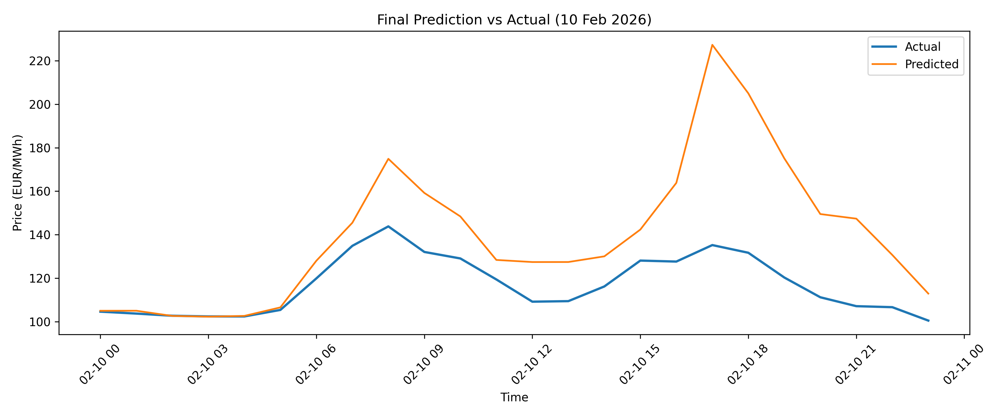
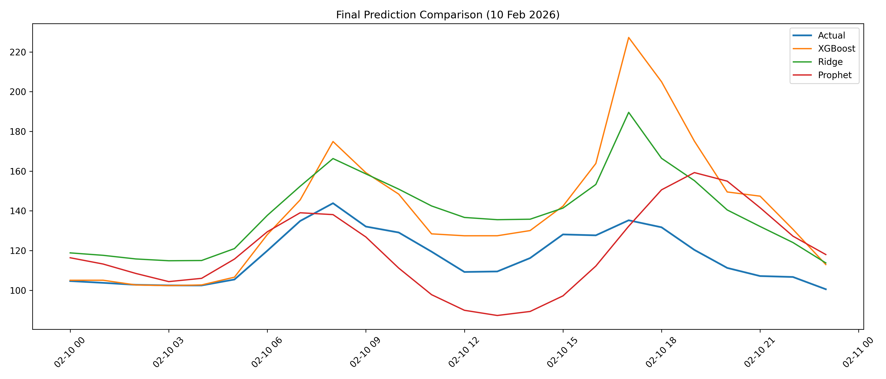

# Forecasting German Day-Ahead Electricity Prices

## Overview

This project builds an end-to-end machine learning pipeline to forecast hourly German day-ahead electricity prices for **10 February 2026** using data from SMARD.

The focus is on **realistic forecasting**, ensuring that models use only information available at prediction time and avoid data leakage.


## Problem

Electricity prices are highly volatile due to supply-demand imbalance, renewable generation, and market dynamics.
The objective is to predict **24 hourly prices for a future day**.


## Data

* Source: SMARD (Germany electricity market data)
* Time range: Jan 2023 → 9 Feb 2026
* Target: Day-ahead price (€/MWh)


## Pipeline

1. Data cleaning & preprocessing
2. Exploratory Data Analysis (EDA)
3. Feature engineering

   * Time features (hour, day, month)
   * Lag features (24h, 48h, 168h)
   * Rolling statistics
   * External variables (load, generation)
4. Model development & comparison
5. Error analysis
6. Final real-world prediction


## Model Progression

| Model              | Description            | MAE      |
| ------------------ | ---------------------- | -------- |
| Lag-24 Baseline    | Previous day same hour | ~22      |
| Ridge (time only)  | Linear baseline        | ~20      |
| Ridge (+ features) | + load & generation    | ~15.3    |
| Prophet            | Time-series model      | ~26.8    |
| XGBoost            | Base model             | ~12.7    |
| XGBoost (tuned)    | Manual tuning          | ~12.2    |
| XGBoost (Bayesian) | Optimized              | **~9.6** |


## Final Forecast (10 Feb 2026)

| Model              | MAE        |
| ------------------ | ---------- |
| XGBoost            | 22.665     |
| Ridge              | 22.140     |
| Prophet            | **16.607** |


## Visual Results
The following plots illustrate model performance on the final prediction task:

### Final Prediction vs Actual (10 Feb 2026)



The model captures the overall trend but struggles during high-volatility periods and price spikes.


### Model Comparison



XGBoost performs best on historical data, while Prophet produces more stable predictions in the real forecasting scenario.

## Key Insights

* XGBoost performs best on historical test data due to richer feature usage
* In real forecasting, performance drops when future information is unavailable
* Prophet performs best in the final prediction because it captures time-series patterns directly


## Data Leakage Awareness

Early models used same-time external variables (e.g., actual load and generation), which are not available for future prediction and introduce data leakage.

The final forecasting setup uses only past information (lag-based features), ensuring realistic and deployable predictions.


## Error Analysis

* Highest errors occur during **afternoon peak hours (13:00–18:00)**
* Model struggles with **extreme price spikes**
* Tendency to **underestimate high-price events**


## Tech Stack

* Python (Pandas, NumPy, Matplotlib)
* Scikit-learn
* XGBoost
* Prophet
* Optuna

## Project Structure

```text
data/
notebooks/
outputs/
```

## Conclusion

This project highlights the difference between:

* **Model accuracy on historical data**
* **Real-world forecasting performance**

While machine learning models achieve low test error, data availability at prediction time becomes the key limitation in practice.
